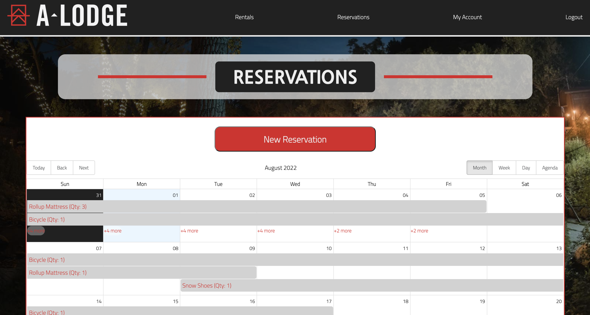
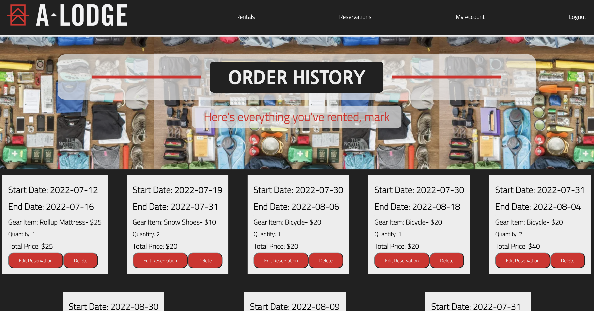
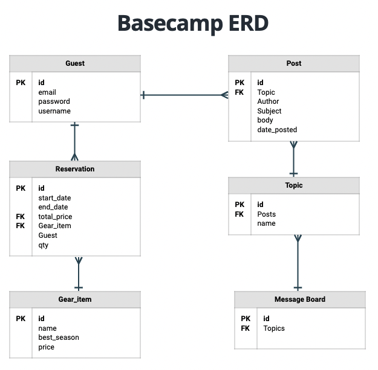
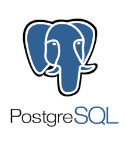

# Basecamp
Deployed at https://a-lodge-basecamp.vercel.app/
(back end deployed at https://a-lodge-basecamp.herokuapp.com/)

Basecamp is a hotel-manager application built for the Boulder Adventure Lodge in Boulder, Co. It's purpose is to help with gear rentals, event ticketing, and to provide guests a message board as a means of connecting with each other.

The front end repository can be found here => 
https://github.com/mgerken86/Basecamp-front-end-react

## USER STORY

Users are welcomed on the Home Page w/ the opportunity to look up local mountain bike trails. They can view available gear and rent for the dates of their choosing. Weather data is provided to users to help them choose what gear makes the most sense for them to rent. Their gear reservations can be modified and deleted.

## Technologies Used

